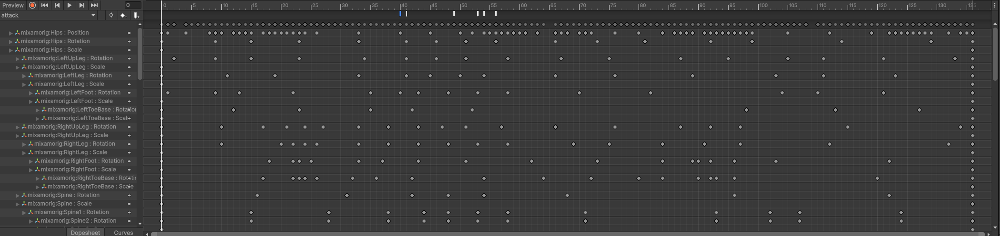
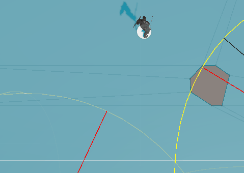

# Blog Post-Dev Update 2
> [!NOTE]
> V.1 Created on <<<>>>

## Introduction
The objective of this milestone was to further enhance our system by improving our enemy AI to be able to follow a route where the enemy could be interuppted by spotting the player and chase after the enemy to attack as well as  lose track and go back original route. 

### Combat Improvements

The combat was improved drastically through the use of events in the attack animation.
A new script for handling combat logic named PlayerCombat.cs was created following the Single responsibility principle.
During the swing animation the following methods are called:




1. The StartAttack() method is called:
   
```


    public void StartAttack()
    {
        IsAttacking = true;
        Debug.Log("Attack started — can now deal damage.");
    }
```

The purpose of this function is to set the boolean field IsAttacking to true:

```
    public bool IsAttacking { get; private set; }
```
2. The next event calls the method EnableSwordHitbox():

```     
public void EnableSwordHitbox() => SwordCollisionScript?.EnableSwordCollider();

```
Which enables the sword collider that is wrapped around the sword object and has the script SowrdCollisionScript as a component:


```
public class SwordCollisionScript : MonoBehaviour
{
    [SerializeField] private Collider swordCollider;

    public void EnableSwordCollider() => swordCollider.enabled = true;
}
```

3. Next, the method PlaySwordSwingSound() is called which handles playing the sound effect for the sword swinging.

4. Then the method public void EndAttack() is called, which handles setting the IsAttacking boolean to false in the PlayerCombat script. The main objective of this is to flag through the animation that the attack has ended.

5. Then The method DisableSwordCollider() in SwordCollisionScript is called which as the name might imply, disables the sword collider
The method OnTriggerEnter(Collider other); is responsible for calling the DealDamage(Collider other); method in SwordCollisionScript:

```
private void OnTriggerEnter(Collider other)
{
   if (ownerCombatant != null && ownerCombatant.IsAttacking)
   {
       DealDamage(other);
   }
}


private void DealDamage(Collider other)
{


   DummyHealth dummy = other.GetComponent<DummyHealth>() ?? other.GetComponentInParent<DummyHealth>();
   if (dummy != null && !hasHit)
   {
       dummy.TakeDamage(swordDamage);
       hasHit = true;
   }
}
```

6. The OnTriggerEnter checks for when the IsAttacking Boolean is set to true, and for if the sword collider has interacted with the enemy hit box, and if these two conditions are met, then it calls the DealDamage which checks if the boolean value for hasHit is false(the hasHit will be set to false by the ResetHit() method at the end of the animation.) for if the enemy hit box has a Dummy Health component, and if yes, then it will transfer the sowrdDamge integer value as a perimeter to the TakeDamage method in the DummyHealth script:


```
[SerializeField] private int health = 100;


public void TakeDamage(int damage)
{
   health -= damage;
   Debug.Log(gameObject.name + " took " + damage + " damage. Remaining health = " + health);


   if (health <= 0)
   {
       Debug.Log(gameObject.name + " is dead!");
       Destroy(gameObject);
   }
}
```

The TakeDamage method then subtracts the swordDamage from the health of the enemy, and if the the health is set to 0, then that enemy is destroyed.
	

7. Finally and at the end of the animation and through an event the method ResetSwordHit() in the Player combat script which calls the ResetHit() method in the sword collision script.


### Stealth Improvements

We have implemented our routing with the help of some scripts in order to make createive levels where the player will need to time their movements to avoid enemies if they want to sneak by.


This was done with two scripts WayPointPath and EnemyPathing where,

#### WaypointPath.cs

This file is responsible for holding the transforms of all positions the enemy needs to move to. 
```
public Transform[] waypoints;
```

The pathing also has the oppurtunity for an alternate route where the enemy could reverse it direction when completing one round.For now the path is by default only loop.

```
public enum PathType
    {
        Loop,
        ReverseWhenComplete
    }

    public PathType pathType = PathType.Loop;
```

Next we have a simple method that would be used in order to get the current way point's transform will be used by the EnemyPathing.cs script.Nothing major, just returning the next waypoint's position.

```
public Vector3 GetCurrentWayPoint()
{
    return waypoints[index].position;
}
```

Next we have the method for getting the next waypoint, where we check if there is no waypoints, so it is a stationary enemy. 

The next index is calculated using a private method  where we get append the direction which for now proceeding with a simple Loop just does a modulus so we do not go out of bounds.

For the case of Reversing when complete, we check if the index is out of bounds and reverses direction and index.

```
    public Vector3 GetNextWaypoint()
    {
        if (waypoints.Length == 0)
        {
            return transform.position;
        }

        index = GetNetWaypointIndex();
        Vector3 nextWaypoint = waypoints[index].position;

        return nextWaypoint;
    }

    private int GetNetWaypointIndex()
    {
        index += direction;

        if (pathType == PathType.Loop)
        {
            index %= waypoints.Length;
        }
        else if (pathType == PathType.ReverseWhenComplete)
        {
            if (index >= waypoints.Length || index < 0)
            {
                direction *= -1;
                index += direction * 2;
            }
        }

        return index;
    }
```

We also had some gizmos to show the waypoints for debugging as we disabled the waypoints mesh rendererrs.

```
private void OnDrawGizmos()
    {
        if (waypoints == null || waypoints.Length == 0)
        {
            return;
        }

        for (int i = 0; i < waypoints.Length - 1; i++)
        {
            if (waypoints[i] != null && waypoints[i + 1] != null)
            {
                Gizmos.DrawLine(waypoints[i].position, waypoints[i + 1].position);
            }
        }

        if (pathType == PathType.Loop || pathType == PathType.ReverseWhenComplete)
        {
            if (waypoints[0] != null && waypoints[waypoints.Length - 1] != null)
            {
                Gizmos.DrawLine(waypoints[waypoints.Length - 1].position, waypoints[0].position);
            }
        }
    }
```

#### EnemyPathing.cs

This script works with the previously discussed WaypointPath.cs and makes use of its public methods in order to control the NavMesh component. 

```
    [SerializeField] float waitTimeOnWayPoint = 1f;
    [SerializeField] WaypointPath path;

    private NavMeshAgent agent;
    Animator animator;
```

Here we grab references to the components reguired for the NavMeshAgent as well as the animator which is present as component in the child of the scripts object.

```
private void Awake()
    {
        agent = GetComponent<NavMeshAgent>();
        animator = GetComponentInChildren<Animator>();
    }
```

Now in the update function we add the  logic where the agent waits for a while before finally setting the next destination that the navmesh agent needs to follow.

While this is occuring we update the animator which uses a blend tree from a idle animation and a zombie walk animation by setting a float "Speed" of the enemy.

```
float normalizedSpeed = Mathf.InverseLerp(0, agent.speed, agent.velocity.magnitude);
if (animator != null)
{
    animator.SetFloat("Speed", normalizedSpeed);
}
```


Finally we have a public method to disable the navmesh agent as there was a funny phenomenon without this where the enemy's corpse would keep patrolling even after being in the "Die" state of animation.

```
    public void DisableAgent()
    {
        if (agent != null && agent.isActiveAndEnabled)
        {
            agent.enabled = false;
        }
    }
```

Ultimately this is the Patrolling Enemy which will be expanded with combat with the use of previously created inFOV method from blog post 1 of the enemy to activate the combat routine.

NOTE: We forgot to mention in the previous blog post, but all animations and character models were retrieved from mixamo.com


### Enemy AI
1. Chasing the player:
   once the player is spotted, the enemy transitions into a Chase state where they dynamically follow the player while keeping a reasonable stopping distance.
   


The logic for the chase is handled inside the DummyAI.cs script using Unity’s built-in NavMeshAgent. The flow goes like this:

```
case AIState.Chase:
    if (inSight)
    {
        agent.isStopped = false;

        Vector3 dir = (player.position - transform.position).normalized;
        Vector3 targetPos = player.position - dir * stopDistance;

        if (NavMesh.SamplePosition(targetPos, out NavMeshHit hit, 1f, NavMesh.AllAreas))
        {
            agent.SetDestination(hit.position);
        }

        lostTimer = LOST_SIGHT_GRACE;
        RotateTowardPlayer();
        SetAnimSpeed(agent.velocity.magnitude);

        if (distance <= stopDistance)
        {
            agent.isStopped = true;
            state = AIState.Attack;
            cooldown = 0f;
        }
    }
```
Key Details:

   The enemy calculates a target position just short of the player to prevent overlapping (stopDistance).

   We use NavMesh.SamplePosition to ensure this point is walkable and valid on the NavMesh.

   The enemy rotates to face the player using Quaternion.Slerp for smooth tracking.

   When the enemy gets close enough, it transitions into the Attack state and stops moving.

If the player moves out of view, a grace period (LOST_SIGHT_GRACE) starts. If the player isn’t seen again in that time, the enemy returns to patrol.

2. Combat:
   When within attack range, the enemy switches to the Attack state, where they face the player and execute melee attacks using timed animation events.


   ```
   case AIState.Attack:
    RotateTowardPlayer();
    SetAnimSpeed(0f);

    cooldown -= Time.deltaTime;

    if (cooldown <= 0f)
    {
        if (animator != null) animator.SetTrigger("attack");
        cooldown = attackCooldown;
    }

    if (distance > stopDistance + 0.5f)
    {
        agent.isStopped = false;
        state = AIState.Chase;
    }
   
   ```

   Combat Events Flow:

    - Attack Triggered:
    The animation is triggered with SetTrigger("attack") once the cooldown allows.

    - StartAttack():
    Called by the animation event to handle the logic:

   ```
   public void StartAttack()
   {
     Debug.Log("Enemy attack started — attempting to deal damage.");

    if (player != null && Vector3.Distance(transform.position, player.position) <= stopDistance + 0.25f)
    {
        PlayerScript target = player.GetComponent<PlayerScript>();
        if (target != null)
        {
            target.TakeDamage(baseDamageToPlayer);
            Debug.Log($"Enemy dealt {baseDamageToPlayer} damage to player.");
        }
    }
   }

   ```

   This checks whether the player is still close enough to take damage and then calls TakeDamage() on the player.

   - PlaySwordSwingSound():
Also triggered by the animation to play a swing SFX using the AudioSource.

   - EndAttack():
Final animation event to wrap up the attack logic (e.g., reset flags, exit state cleanly).
