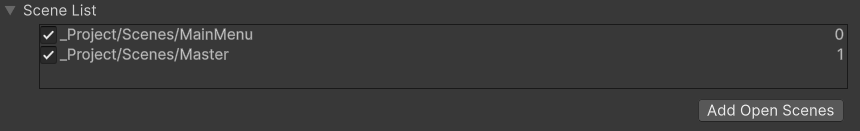
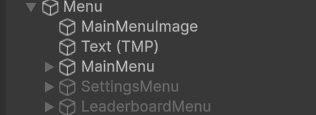
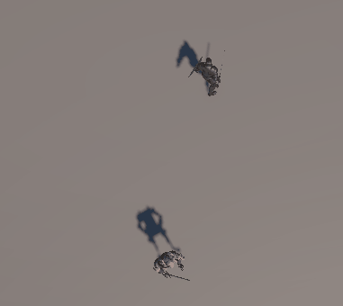

# Blog Post-Dev Update 1
> [!NOTE]
> V.1 Created on <<<>>>

## Introduction
The objective of this milestone was to successfully establish the core elements of 
our game, namely allowing the player to sneak past enemies or engage them in combat. 
In the following sections, we will be showcasing and discussing how we implemented our
systems as well as the user interface,player movement, and animations.

### Menu
Every game needs a way to start, pause, and quit. It’s the player's first impression of your game, so we figured it should be clean, functional, and easy to navigate. Well, we hope it would be that eventually, right now its very basic but it does the job. The menu itself is simple so we wont go too deep, but its a fundamental part of the game, so we cannot omit it either.

The main menu resides in its own scene called **MainMenu**. The **MainMenu** Scene its the entry point of the application and the first thing shown.



Since, some of the functionality in the main menu is also in the pause menu. We created a **MenuManager** script that can hopefully be reused by the buttons in the pause and start menu.


Taking a look at some of the events in the **MenuManager**. 

**StartGame** prompts the SceneManager to load scene named "Master" which is where the game resides. Exit game is pretty self explanatory.
```
public void StartGame() {
        SceneManager.LoadScene("Master");
        Debug.Log("Start");
}

public void ExitGame() {
        Application.Quit();
        Debug.Log("Exit Game");
}
```
How about other screens? MainMenus usually have more than one "menu" inside them - setting and leaderboards. There are several approaches we could have taken. One of is making a scene for each menu and using the SceneManager to load it, however that felt like an overkill, so we went with a different approach.

Taking a look at the MainMenu itself. Its a Canvas element with several children (or the other menues.)



An example scenario would be going to the Settings Menu. The main menu screen would be disabled and the settings enabled. To aid with this we created a helper function that shows a menu that is passed. The helper function also handles the automatic selection of buttons, when the menu changes.

```
    public void ShowMenu(GameObject menuToShow)
    {
        // Hide the current menu
        if (currentMenu != null)
            currentMenu.SetActive(false);

        // Show the new menu
        menuToShow.SetActive(true);
        currentMenu = menuToShow;
        
        if (currentMenu != mainMenu) {
         SelectButton(currentMenu, "ReturnToMainMenuButton");
        }
        else { 
            SelectButton(currentMenu, "StartButton");
        }
    }
```


And here is the final, first version of the main menu.


### Combat  
Combat:
The main objective of this system was to give the player the ability to perform melee attacks. This was done by adding collisions to the objects, and some animations for the combat. A dummy enemy was added for testing collisions.



Code explantation: 
Dummy enemy: 

```
public class DummyHealth : MonoBehaviour
{
    [SerializeField] private int health = 100;


    public void TakeDamage(int damage)
    {
        health -= damage;
        Debug.Log(gameObject.name + " took " + damage + " damage. Remaining health = " + health);


        if (health <= 0)
        {
            Destroy(gameObject);
        }
    }
```
In the enemy script that is responsible for the dummy’s health(DummyHealth) the method TakeDamage will be called when the dummy receives damage in the game, the method takes the damage from the player as a perimeter, and subtract said damage from the dummy’s health, and if it’s health is reduced to 0 then the dummy is destroyed(dies).

Sword collision: 
```
public class SwordCollision : MonoBehaviour
{
    [SerializeField] private int swordDamage = 10; // can be changed in Inspector


    private void OnTriggerEnter(Collider other)
    {
        Player player = GetComponentInParent<Player>();
        if (player != null && player.isAttacking)
        {
            DummyHealth dummy = other.GetComponent<DummyHealth>();
            if (dummy != null)
            {
                // Use the Inspector-adjustable damage
                dummy.TakeDamage(swordDamage);
            }
        }
    }
```
The sword collision object is attached to an object that is wrapped around the sword model in the game, and when the player(the parent) activates the Attack animation and the sword collision object collides with a rigid body, the method OnTriggerEnter is called, the method checks if the player has activated the attack animation(if (player != null && player.isAttacking)) otherwise the sword object might be clipping through the enemy.
If the sword object hits another object that has a DummyHealth script, then it calls the TakeDamage method from that script, and it passes the sword damage to the method.
Player:
```
public bool isAttacking = false;
The boolean field isAttacking is used for the animation of the attacking.

    private void PerformAttack()
    {
        animator.SetTrigger("attack");
        isAttacking = true;
    }
```
The performAttack method is called when the animation for the attack is activated. The trigger “”attack” is called, and isAttacking is set to true.
```
    public void EndAttack()
    {
        isAttacking = false;
        Debug.Log("Attack ended - no longer dealing damage on collision.");
    }
```
The EndAttack method is called through an event that is activated at the end of the sword swing animation, it sets the isAttacking field back to false so that the sword doesn’t damage the dummy when it is clipping through it.


### Stealth 

The main objective of this system was to have enemies that could detect the player 
character as well as allow the player to sneak behind and stealthily attack an enemy.

#### Enemy Field of View


Here we implemented a system where the enemy object could detect the player if 
within a certain range and angle ahead of the object.

```
private void OnDrawGizmos()
{
    Gizmos.color = Color.yellow;
    Gizmos.DrawWireSphere(transform.position, maxRadius);

    Vector3 fovLine1 = Quaternion.AngleAxis(maxAngle, transform.up) * transform.forward * maxRadius;
    Vector3 fovLine2 = Quaternion.AngleAxis(-maxAngle, transform.up) * transform.forward * maxRadius;

    Gizmos.color = Color.blue;
    Gizmos.DrawRay(transform.position, fovLine1);
    Gizmos.DrawRay(transform.position, fovLine2);

    if (!isInFOV)
    {
        Gizmos.color = Color.red;
    }
    else
    {
        Gizmos.color = Color.green;
    }
    Gizmos.DrawRay(transform.position, (player.position-transform.position).normalized*maxRadius);

    Gizmos.color = Color.black;
    Gizmos.DrawRay(transform.position, transform.forward * maxRadius);
}
```
We also added some gizmos in order to see the correct parameters for range and
angle for the enemy view in order to tweak detection so it is fair for the player.
For now the enemy does not start moving and attacking the player which will be
added in the next milestone and currently changes the color of the ray to the
player to show detection.

```
public static bool inFOV(Transform checkingObject,Transform target,float maxAngle,float maxRadius)
{
    Collider[] overlaps = new Collider[10];
    int count = Physics.OverlapSphereNonAlloc(checkingObject.position, maxRadius, overlaps);

    for(int i = 0; i < count + 1; i++)
    {
        if (overlaps[i] != null)
        {
            if (overlaps[i].transform == target)
            {
                Vector3 directionBetween = (target.position - checkingObject.position).normalized;
                directionBetween.y *= 0;

                float angle = Vector3.Angle(checkingObject.forward, directionBetween);

                if(angle <= maxAngle)
                {
                    Ray ray = new Ray(checkingObject.position, target.position - checkingObject.position);
                    RaycastHit hit;

                    if(Physics.Raycast(ray,out hit, maxRadius)){
                        if (hit.transform == target)
                        {
                            return true;
                        }
                    }
                }
            }
        }
    }

    return false;
}
```
#### Usage:
```
    public Transform player;
    public float maxAngle;
    public float maxRadius;

    private bool isInFOV=false;

void Update()
{
    isInFOV = inFOV(transform, player, maxAngle, maxRadius);
}
```
Here is the script where we detect if the player is in the enemy's FOV by:
<ol>
<li>Finding objects within the maxRadius of the checkingObject(Enemy) and storing it the array overlaps.

<li>We then go through this list checking if null and if the object is the target(Player),

<li>and checking if the angle to the player and the enemy is less than the maxAngle.

<li>A raycast is then sent to see of there is actual line of sight and no objects in between,

<li>Finally returns true if all previous conditions are fulfilled
</ol>


#### Stealth Attack


### Level

