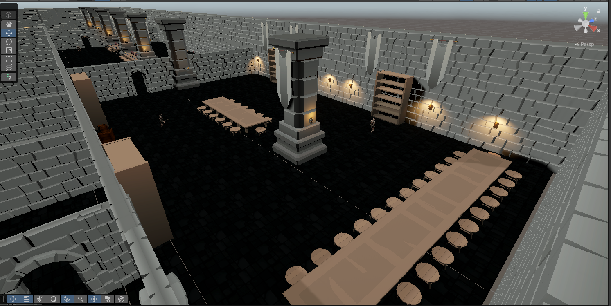
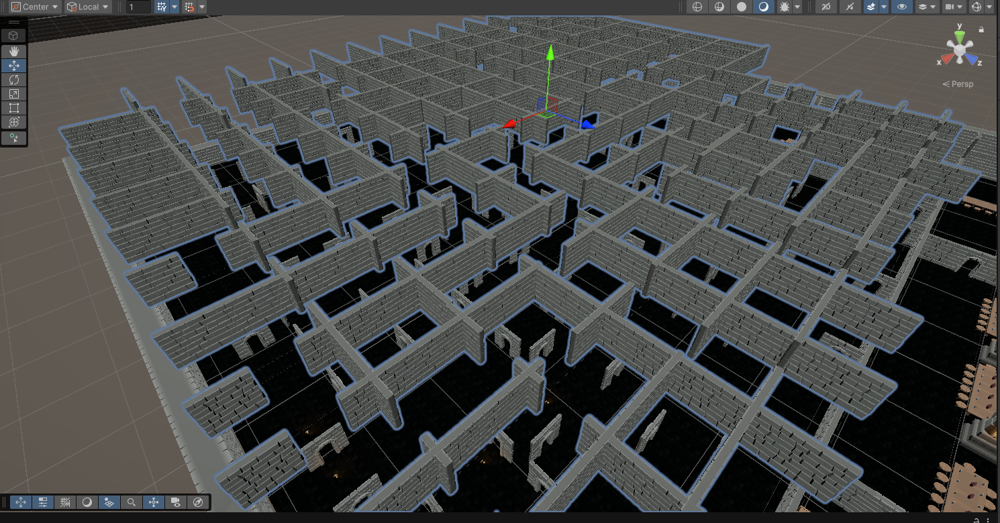
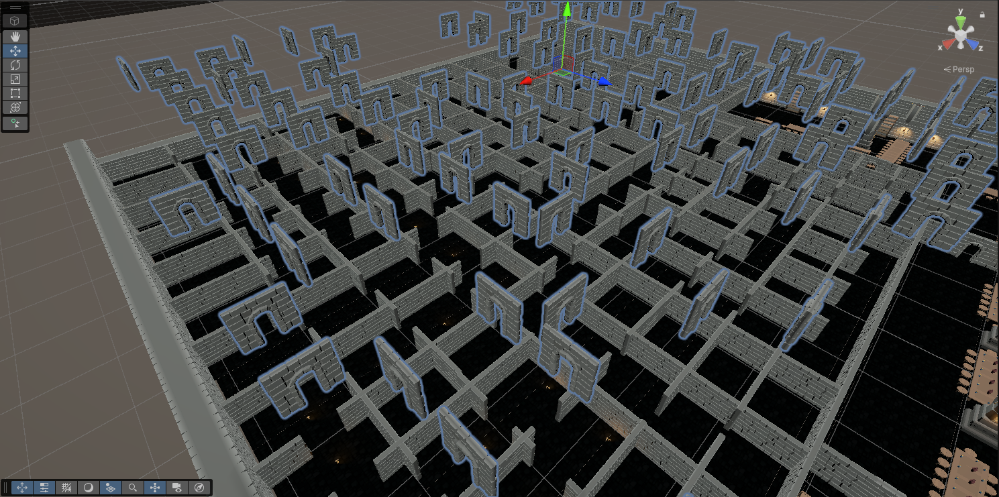
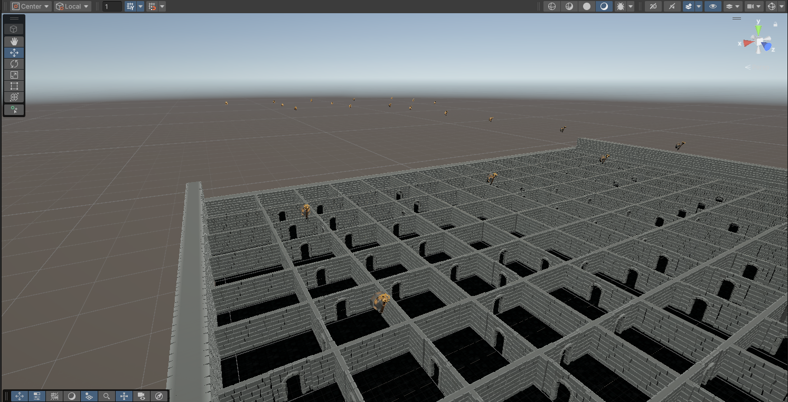

# Blog Post-Dev Update 3
> [!NOTE]
> V.1 Created on <<<>>>

## Introduction
The objective of this milestone was to create the map and environment with a design that would make sense from a top-down third person pesepective which would allow the player to see the area an enemies clearly.

To build the environment, we wanted to create out environment using blender but we struggled with the controls and quickly opted for scouring the asset store in order to find assests that could match our game's style and mood.

Eventually we settled on Lite Dungeon Pack - Low Poly 3D Art by Gridness Studio which has modular prefabs which also came with some environmental props that overall made a decent looking code.

## Rooms

## Level Design

The level is organized into grouped assets. We began by designing a single room, populating it with various objects to create a sense of abandonment. All these assets were grouped together under an empty parent object for easier management.

We then duplicated the room and rearranged some of the assets to build connected hallways. The main goal of these halls was to populate them with enemies, encouraging the player to approach the level with more caution.

## Maze

The maze is made up of three different groups of assets:

1. The walls of the maze:

   
   
2. The doors that lead to different paths across the maze, many of which are misleading:

   

3.And torches to light the way:

