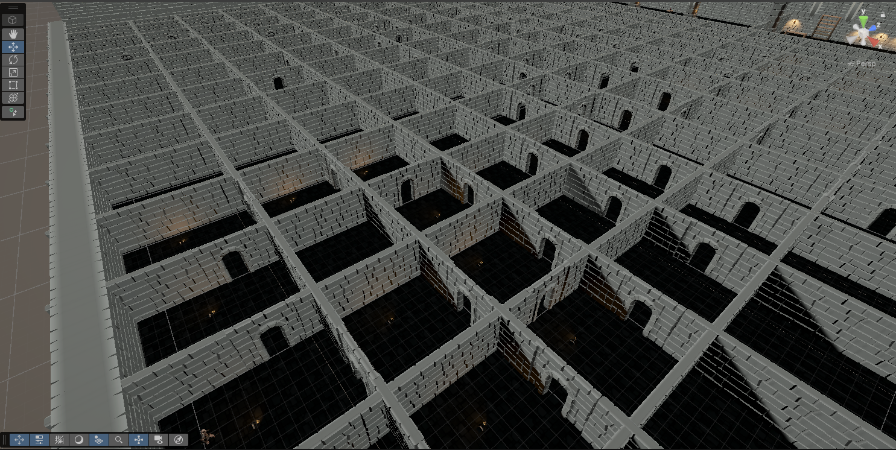

# Dungeon Rush Showcase
> [!NOTE]
> V.1 Created on <<<>>>

## Introduction
In this blog post we will showcase the different parts of our game. The main objective is to present all aspects of the game, from level design, to combat, to the enemy behavior.

For the level design we wanted the player to feel claustrophobic. We wanted a more horror feel for the game, so we decided to make a maze for the player to traverse. 

We populated the maze with patrolling zombies that can come at the player out of nowhere if they are not careful.

But the player has the option to fight back, they can choose to engage in melee:

Or by taking a more cloak and dagger approach:

Beside the maze, we also made halls that are festered with enemies:

 And if the player must be more careful while going around:

